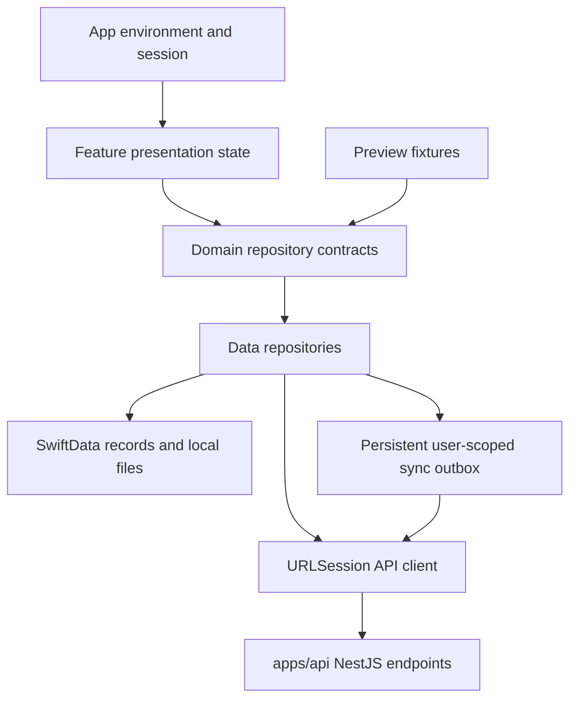

**Keihatsu: Flutter → native SwiftUI migration plan**

Prepared from the working tree on 5 September 2026, based on commit `a043adc`. Product reference: [Flutter](../flutter/lib). Native target: [Keihatsu](Keihatsu). Backend reference: [NestJS API](../api/src).

The recommended path is to finish the existing native screens, introduce real API fetching with browsing, and make reading, persistence, and sync reliable before final polish. Preserve Keihatsu’s content hierarchy and reading behavior while using SwiftUI navigation, controls, and iOS 26 Liquid Glass.

**Branch workflow**

`feat/ios-migration` tracks `main` and is the integration branch for this migration. Each phase is implemented on its own branch and reviewed through a pull request before it enters the integration branch. Dependent phases are stacked while their prerequisite PR is open, then retargeted to `feat/ios-migration` after the prerequisite merges. The integration branch is tested as a whole before it is proposed for `main`.

This is a planning deliverable, not an implementation phase. It retains the eight phase numbers in [AGENTS.md](Keihatsu/AGENTS.md), adds live data work to the relevant phases, and inserts **Phase 6A** between Phases 6 and 7 for download and manga-reading Live Activities. Phase 0 is an existing foundation; it should not be regenerated. Backend changes described as **proposed** below do not exist yet. Live Activities were added to this plan on 6 September 2026; their implementation is pending.

**What actually exists today**

The migration instructions describe an older scaffold. The current source has a more developed prototype:

| Area | Evidence in the current iOS app | Migration consequence |
| --- | --- | --- |
| App entry | [KeihatsuApp.swift](Keihatsu/KeihatsuApp.swift) launches `ContentView`; the previous environment/router entry is commented out. | Reconnect dependency and route ownership around the active app. Do not revive the old shell wholesale. |
| Navigation | [ContentView.swift](Keihatsu/ContentView.swift) has Home, Library, History, Plugins, and a Search-role tab. Profile and Notifications open from Home’s toolbar. | Preserve this arrangement as explicitly requested. Adapt the old router to the active shell. |
| Browsing | Home, Library, History, Plugins, Search, and notifications already have SwiftUI layouts. Much of their content is `images`, inline arrays, or `sampleData`. | Reuse compositions and artwork transitions; replace their data ownership and inactive actions. |
| Details | [CarouselDetailView.swift](Keihatsu/Features/MangaDetails/CarouselDetailView.swift) has artwork, chapters, category selection, and in-memory read/bookmark state. | Evolve into a feature driven by real manga/chapter identities. |
| Reader | [ReaderView.swift](Keihatsu/Features/Reader/Views/ReaderView.swift) reads bundled Ordeal images, offers a slider/chapter controls, and presents sample comments. | Preserve useful UI, replace bundle enumeration and view-owned state with a reader subsystem. |
| Preferences and sync | [AppPreferencesStore.swift](Keihatsu/Data/Preferences/AppPreferencesStore.swift) really persists preferences in UserDefaults. [SyncQueueStore.swift](Keihatsu/Data/Sync/SyncQueueStore.swift) is an in-memory demonstration; “complete” does not perform network work. | Keep compatible preference decoding. Replace simulated sync before exposing it as functional. |
| Platform | [project.pbxproj](Keihatsu.xcodeproj/project.pbxproj) declares iOS **26.5**, Swift language mode **5.0**. | Use the existing deployment target as the baseline. Review whether 26.5 is intentional in Phase 1; an iOS 26 visual direction alone does not require changing it. |

**Feature coverage and parity boundaries**

“Working” here means behavior is present in the inspected source, not that the running app or upstream providers were verified during this planning pass.

| Flutter feature | Current behavior / limitation | iOS delivery |
| --- | --- | --- |
| Onboarding and account entry | Three-page onboarding, skip/finish persistence, Google sign-in/sign-up, guest entry. | Shell in Phase 1; real sessions in Phase 5. |
| Main navigation | Active `MainNavigationBar` delegates to `floating_nav.dart`: Home, Library, History, Extensions, Profile. | User-directed native adaptation: retain Home, Library, History, Plugins/Extensions, Search tabs; Profile and Notifications remain Home toolbar sheets, and Settings stays inside Profile. |
| Home | Continue Reading from local history, latest titles aggregated across enabled sources, deduplication by source + manga ID, cover carousel, refresh. | Live browse in Phase 2; reading continuity in Phase 4; account restoration in Phase 5. |
| Search and extensions | Source-grouped search; five recent queries. Current search and source activation are restricted to **ManhuaTop**. Other registered sources are not equivalent to enabled product support. Source pin/enable state is local; its repository does not currently sync those changes. | Phase 2 preserves this availability restriction and local controls; Phase 5 wires supported source preferences to the API. |
| Library | Category management and assignment, search, five filters, six sort modes, four grid/list display modes, density, unread/download/language badges and category counts. Library add/update actions require a token. | UI/state in Phase 2, details actions in Phase 3, authenticated persistence/sync in Phase 5, physical download badges in Phase 6. |
| History | Local records grouped by date, latest chapter context, selection, deletion, reader entry; server import/sync. Search action is a TODO in Flutter. | Phase 2 UI, Phase 4 local reader integration, Phase 5 remote sync. Existing native history search can remain as an enhancement. |
| Details | Layered artwork, expandable description, initially three visible chapters, full list, downloaded/unread/bookmarked filters, categories, read/resume, popular titles as recommendations, batch downloads. Share is explicitly unimplemented in Flutter. | Phase 3; reader/download actions become complete in Phases 4/6. Native sharing is a small enhancement, not a missing live API. |
| Reader | Vertical continuous reading, tap-to-toggle controls, page slider, chapter boundaries and append, previous/next, bookmarks, comments; local pages → CBZ → remote fallback. | Phase 4 for live reading/local progress, Phase 5 for remote history/comments, Phase 6 for downloads. |
| Reader preferences | Flutter’s inspected reader does not implement a complete horizontal/paged mode, brightness control, or reliable page-level resume; its slider estimates page positions by total scroll fraction. | Accurate resume/positioning is planned in Phase 4. Additional reading modes and brightness are explicit enhancements, not claimed Flutter parity. |
| Profile/community | Editable username/bio/banner and Blobatar configuration, public profile and visibility, API-backed profile totals; reader comments include replies, likes, images, and author profiles. | Phase 5, with SwiftUI forms, PhotosPicker, sheets, and shared avatar rendering. |
| Downloads/storage | Durable queue, pause/resume/retry/remove/reorder, source/manga grouping, local CBZ creation/deletion and storage reporting. Queue screen also has mock fallback content. | Phase 6; real empty states replace production sample queues. |
| Live Activities | Requested native enhancement for chapter downloads and manga reading; the generated mockups are visual concepts, not an implemented feature or a platform specification. | Phase 6A consumes Phase 4 reader sessions and Phase 6 downloads; supports Lock Screen and every Dynamic Island presentation, with lifecycle and privacy controls. |
| Appearance/settings | Theme modes, accent presets, pure-black option, library/category preferences, privacy. Several other Flutter settings destinations do nothing. Native app also has settings without working engines. | Functional appearance in Phase 1, display settings in Phase 2, server preferences/privacy in Phase 5, storage in Phase 6; audit unsupported controls in Phase 7. |
| Incognito | Flutter toggles profile state/indicator; the inspected reader does not consult it. Native preference persists, but reader enforcement is absent. | Phase 4 implements the promised “do not save history” behavior as a deliberate correction. |
| Updates/calendar/inbox/statistics | Dedicated updates feed, upcoming calendar, notification lists, and statistics chart use mock/static data; the API has profile statistics but no equivalent feed/calendar/notification controllers. | Phase 2 can port fixture-driven UI; Phase 7 resolves production behavior and the separate backend backlog. |
| Help/about/donation | Bug reports have an API. Help email, feature suggestions, and donation actions are incomplete; About is largely static. | Phase 7 finishes supported routes/content. Payment processing and tracking integrations are not existing parity requirements. |

**Native iOS 26 direction**

Use native bars, sheets, and controls as the starting point. Apple’s standard components adopt Liquid Glass, and Apple recommends removing custom navigation backgrounds that interfere with it. Keihatsu’s artwork and manga pages remain the content layer; reserve glass for navigation and floating controls. [Apple: Adopting Liquid Glass](https://developer.apple.com/documentation/technologyoverviews/adopting-liquid-glass), [Apple HIG: Materials](https://developer.apple.com/design/human-interface-guidelines/materials).

| Product element | SwiftUI treatment |
| --- | --- |
| Main shell | `TabView` with a `NavigationStack` per primary tab and retained navigation state. Large titles outside details/reader. Use `.tabBarMinimizeBehavior(.onScrollDown)` where it preserves access and content visibility. |
| Search | Preserve the current Search-role tab and its searchable destination. Do not relocate it to Home’s toolbar. |
| Home rails/cards | `ScrollView(.horizontal)`, lazy stacks, existing carousel behavior, stable manga IDs, shared cover loading. Preserve cover proportions, hierarchy, and browsing density. |
| Library | Adaptive `LazyVGrid` and `List` variants; a category selector that accommodates many categories; `Menu`, `Picker`, `Toggle`, and a filter/sort/display sheet. Avoid squeezing arbitrary category names into one fixed segmented control. |
| Details | Scrollable artwork and metadata with a concise collapsing title. Native toolbar actions and a safe-area-aware Read/Resume bar. Reuse matched artwork transitions when the source card exists. |
| Reader | Edge-to-edge page content, hidden tab bar, toggled controls, native `Slider`, settings/comments sheets. Group nearby custom glass controls with `GlassEffectContainer`; use `.glassEffect` or glass button styles selectively. |
| Account/settings | `Form`/`List`, `Section`, `LabeledContent`, `Toggle`, `Picker`, `PhotosPicker`, native alerts and confirmation dialogs. SF Symbols for system actions; retain brand typography where it adds identity. |
| Loading/failure | `ProgressView`, `ContentUnavailableView`, inline retry, pull-to-refresh, and cached-content indicators. A failed request must not quietly turn into sample manga or a fabricated empty library. |

The tab minimization, search, sheet, and custom-glass APIs above are covered in [Apple: Build a SwiftUI app with the new design](https://developer.apple.com/videos/play/wwdc2025/323/) and [Applying Liquid Glass to custom views](https://developer.apple.com/documentation/swiftui/applying-liquid-glass-to-custom-views).

Keep colors, spacing, typography, corner treatment, and motion in the existing design system. Support Dynamic Type, light/dark/pure-black appearance, VoiceOver labels and focus, Increase Contrast, Reduce Transparency, and Reduce Motion throughout implementation. Validate custom glass over both light and dark manga pages; system components adapt to accessibility settings automatically, while custom effects still need review. [Apple: Adopting Liquid Glass](https://developer.apple.com/documentation/technologyoverviews/adopting-liquid-glass).

**Data architecture to establish once**

- **Presentation:** focused MVVM with `@MainActor` observable feature state and async/await. Keep existing `ObservableObject` stores where useful; introduce modern Observation for new features without an unrelated state-system rewrite. Views render state and dispatch intents.
- **Composition:** evolve `AppEnvironment`, `AppServices`, and `AppNavigation`. One composition root selects live, preview, or test repositories. Avoid a second dependency graph beside the active `ContentView`.
- **Domain:** `Manga`, `Chapter`, `ReaderPage`, `LibraryEntry`, `Category`, `ReadingProgress`, `Source`, `UserProfile`, `Comment`, and typed identities. Separate library-level flags from chapter-level bookmarks/read status.
- **Identity:** manga identity is `(sourceID, mangaID)`; chapter identity includes manga/source/chapter; user-owned durable records additionally include `ownerUserID`. Preserve backend UUIDs separately for library/category mutations. Never use generated preview UUIDs or chapter numbers as API identities.
- **Persistence:** recommend SwiftData for library/history/categories, metadata, queue records, and sync operations. Use a storage actor/isolated contexts. Keep image bytes/CBZ files on disk, not in the object store. Keep compatible device preferences in UserDefaults and access tokens in Keychain.
- **User scope:** treat guest and authenticated accounts as separate scopes. Match Flutter’s sign-in gate for library mutations. Guest reading history stays local; do not silently merge it into an account. Cancel or isolate requests and queued writes when the account changes.
- **Existing users:** restore server-synced Flutter account data through the API. Flutter’s Isar database, guest history, and downloaded CBZ files do not automatically become accessible to a separately installed native app. Preserve the native prototype’s UserDefaults data; an explicit Flutter export/native import path is a separate enhancement if local-only data transfer is required.
- **API:** a typed async `APIClient`, endpoint definitions, explicit request/response DTOs, mappers, status-aware errors, cancellation, configurable timeout policies, and multipart support. No HTTP calls from views. Attach the bearer token only to the Keihatsu API, not source image hosts.
- **Images:** one cache/image pipeline for covers and reader pages, with memory limits, disk cache, cancellation, dimensions/downsampling, and source-specific headers/proxy handling. A plain `AsyncImage` in every reader row is insufficient for the required offline and memory behavior.
- **Sync:** local transaction plus durable outbox entry for user changes; repositories publish local changes immediately. Replay dependency-sensitive operations in order. Preserve deletions as tombstones until reconciled; avoid resurrecting deleted records during bootstrap.
- **Fixtures:** convert representative Dart/sample content into JSON under `Resources/MockData`; previews use the same contracts and decoding shapes as live features. Production does not silently substitute fixtures after API errors.

**Phase sequence**

| Phase | Reviewable outcome | Data milestone | Depends on |
| --- | --- | --- | --- |
| 1 | One coherent native shell and dependency graph | DTO/repository boundaries, configuration, fixture loaders | Existing foundation |
| 2 | Core browsing and collection surfaces | Live sources, Home, and search; collection UI fixtures/local state | 1 |
| 3 | Complete manga detail journey | Live metadata, chapters, recommendations | 2 |
| 4 | Reliable immersive reader | Live pages, local progress/history/bookmarks, image cache | 3 |
| 5 | Real accounts, collections, and community | Auth, durable library/category/history/preferences sync, profiles/comments | 4; backend fixes listed below |
| 6 | Usable offline reading and download management | Local downloads/CBZ, durable background queue and storage accounting | 4–5 |
| 6A | Download and reading-session Live Activities | ActivityKit projections of real queue/session state; privacy, routing, and lifecycle recovery | 4–6 |
| 7 | Supporting features and interaction polish | Bug reports, real statistics, honest feed/notification states | 2–6A |
| 8 | Release candidate with measured performance | End-to-end parity, migration and failure recovery verification | 1–7, including 6A |

**Phase 1 — Preserve the active app shell and establish contracts**

Purpose: connect the existing prototype to one dependency graph, bootstrap flow, and data-contract foundation while preserving its navigation and screen placement. The user’s instruction to retain the current navigation supersedes the older Flutter-tab reconciliation guidance in `AGENTS.md`.

Flutter references inspected: [main.dart](../flutter/lib/main.dart), [MainNavigationBar.dart](../flutter/lib/components/MainNavigationBar.dart), [floating_nav.dart](../flutter/lib/components/floating_nav.dart), [OnboardingFlow.dart](../flutter/lib/screens/OnboardingFlow.dart), [LoginScreen.dart](../flutter/lib/screens/LoginScreen.dart), [ProfileScreen.dart](../flutter/lib/screens/ProfileScreen.dart), and the model/repository files linked above.

Deliverables:

- Preserve the current order, labels, icons, and placement: Home, Library, History, Plugins (the Extensions surface), and Search remain tabs. Profile/Account and Notifications remain Home toolbar actions opening their existing sheets. Settings remains inside Profile. Do not add, remove, rename, reorder, or relocate these destinations.
- Reuse `ContentView` as the tab composition; connect tab selection and independent navigation paths to a state-only `AppNavigation` object. `ContentView` remains authoritative for layout; preserve the user’s deletion of the old router. Retire stale commented shell code after the active route graph works. Establish typed manga/reader route contracts carrying source and chapter context; existing sample details/reader destinations continue to work until their data migration phases.
- Port onboarding with persisted completion and guest/account-entry shell states. Keep native launch behavior lightweight; do not fetch the entire catalogue before showing the app.
- Wire one shared theme/preference source to the existing tokens, preserving saved appearance settings. Add reusable shell controls only where used; cover/card extraction belongs with the later browsing work.
- Define DTOs and repository contracts, API environment configuration, preview fixtures, and a minimal network transport. Include an early source/reader identity contract so the reader does not need a later model replacement.
- Retain the current deployment target while documenting its intent. Keep Swift concurrency changes scoped; Swift language-mode migration is not required to ship this phase.

Planned iOS files: modify `KeihatsuApp.swift`, `ContentView.swift`, `App/AppEnvironment.swift`, `App/AppNavigation.swift`, relevant `App/Root` files and design tokens. Add `App/AppBootstrap.swift`, `Features/Authentication/Views/OnboardingView.swift`, `Core/Networking/APIConfiguration.swift`, `Core/Networking/APIClient.swift`, initial `Domain/Entities`, `Domain/Contracts`, `Data/DTOs`, and `Resources/MockData` files, plus focused unit/UI test targets. Paths are under `apps/ios/Keihatsu` unless otherwise noted.

Exit checks: fresh install, completed onboarding, guest entry/relaunch, every existing tab including Search, Home→Profile, Home→Notifications, Profile→Settings, retained per-tab back stacks, theme persistence, fixture decoding and live transport configuration. Confirm that all existing placements remain unchanged. No production sample “Sync complete” action remains active. Real Google sessions, live browsing UI, persistence/sync engines, and reader migration remain in their assigned later phases.

Suggested commit: `feat(ios): establish phase one app foundation`

**Phase 2 — Port core pages and fetch live discovery data**

Purpose: deliver the first real-data browsing milestone by extending the existing native screens. Per the user’s Phase 2 instruction, keep the current SwiftUI carousel, cards, grid, rows, navigation, and screen placement; use Flutter as a behavior/data reference, not a replacement layout.

Flutter references inspected: [HomePage.dart](../flutter/lib/screens/HomePage.dart), [SearchScreen.dart](../flutter/lib/screens/SearchScreen.dart), [LibraryScreen.dart](../flutter/lib/screens/LibraryScreen.dart), [LibraryDisplaySettingsSheet.dart](../flutter/lib/components/LibraryDisplaySettingsSheet.dart), [HistoryScreen.dart](../flutter/lib/screens/HistoryScreen.dart), [ExtensionsScreen.dart](../flutter/lib/screens/ExtensionsScreen.dart), [sources_repository.dart](../flutter/lib/services/sources_repository.dart), [offline_library_provider.dart](../flutter/lib/providers/offline_library_provider.dart).

Deliverables:

- Implement `SourcesRepository` and `MangaRepository` live reads. Load the full source catalogue without authentication, then apply local availability/enable/pin preferences. This matches Flutter and avoids losing disabled sources from management UI when authenticated `GET /sources` filters them out.
- Populate Home’s latest carousel/rails using `GET /sources/{sourceID}/manga?type=latest&page=1` for enabled sources. Use bounded parallel requests, source+manga deduplication, explicit per-source failures, cached content, and pull-to-refresh.
- Port source-grouped search, five recent queries, loading/no-results/failure states, and pagination using `hasNextPage`. Use cancellable tasks and query-generation checks so old responses cannot replace new results. Preserve the current ManhuaTop gate; additional source activation is a separate readiness decision.
- Port Library’s downloaded/unread/started/bookmarked/completed filters; alphabetical/last-read/last-updated/unread-count/total-chapters/date-added sorting; compact/comfortable/cover grid/list modes; density, badges, category counts, and category editing UI.
- Port date-grouped History with selection and deletion presentation; Profile/Settings navigation roots; Extensions’ Sources/Plugin Store/Migrate layout. Plugin Store and Migrate must reflect their current incomplete behavior rather than imply downloadable native plugins.
- Use repository-backed fixtures for authenticated collections until Phase 5. Preserve real local guest history once Phase 4 writes it. Scaffold Updates/Calendar/Inbox UI with fixtures only in previews; these are not live API feeds.

Planned iOS files: existing Home/Library/History/Profile/Settings views, `Features/Plugins/Views/PluginsView.swift`, `Features/Search/Views/GlobalExtensionSearchView.swift`; add focused view models/components, `Data/API/SourcesAPI.swift`, live source/manga repositories, `Core/Networking/ImagePipeline.swift`, `Data/Cache` and source preference storage. Retain the Plugins folder initially; user-facing “Extensions” does not require file churn.

Exit checks: real API titles and covers appear; one failing source does not erase successful data; zero enabled sources has an actionable empty state; stale searches are ignored; pagination stops correctly; all four library layouts and filters work with representative data, including long titles and many categories.

Suggested commit: `feat(ios): connect native browsing to the sources API`

**Phase 3 — Complete manga details and reader entry**

Purpose: turn the existing carousel detail prototype into the real browsing-to-reading journey.

Flutter references inspected: [MangaDetailsScreen.dart](../flutter/lib/screens/MangaDetailsScreen.dart), [manga_repository.dart](../flutter/lib/services/manga_repository.dart), [manga.dart](../flutter/lib/models/manga.dart), [chapter.dart](../flutter/lib/models/chapter.dart), [local_models.dart](../flutter/lib/models/local_models.dart).

Deliverables:

- Load manga metadata and chapters independently/concurrently; load same-source popular recommendations separately so they do not delay chapter access. Replace `ImageModel` and integer `ChapterEntry` assumptions with domain entities.
- Preserve artwork prominence, description expansion, chapter count/preview/full list, downloaded/unread/bookmarked filtering, category selector, and clear primary Read/Resume action.
- Define deterministic chapter order, including fractional numbers and nonnumeric/special chapter names. No history starts at the oldest chapter; unfinished history continues that chapter; finished history advances when another chapter exists.
- Persist metadata/chapter records through the local repository. Refresh metadata without erasing read/bookmark/download state. Carry source, manga, chapter ID, launch origin, and saved position into the reader route.
- Give library/category controls real authentication gating; fixture sessions exercise their future states. Defer actual account writes to Phase 5 and physical downloads to Phase 6. Provide native `ShareLink` for a valid source URL as a documented improvement over Flutter’s placeholder.

Planned iOS files: evolve `Features/MangaDetails/CarouselDetailView.swift`, then extract `MangaDetailsViewModel.swift`, feature components, chapter filters and `Domain/UseCases/ResolveResumeChapter.swift`. Add `Data/API/MangaAPI.swift`, metadata/chapter persistence records and mappings; update app routes and the shared cover pipeline.

Exit checks: a live title opens from Home/Search; metadata and chapter failures have independent retry; downloaded/bookmarked filters compose; empty chapter lists cannot crash; resume chooses the correct chapter; a refresh preserves local reading flags.

Suggested commit: `feat(ios): load manga details and preserve reader context`

**Phase 4 — Build the reader engine and local continuity**

Purpose: make live reading feel complete before expanding account and download behavior.

Flutter references inspected: [MangaReaderScreen.dart](../flutter/lib/screens/MangaReaderScreen.dart), detail resume logic, [manga_repository.dart](../flutter/lib/services/manga_repository.dart), [history_repository.dart](../flutter/lib/services/history_repository.dart), [Comments.dart](../flutter/lib/components/Comments.dart), and [download_provider.dart](../flutter/lib/providers/download_provider.dart).

Deliverables:

- Split the current reader into presentation state, chapter loading, page-source resolution, position tracking, prefetch/cache policy, progress persistence, and overlay components. Keep the visible UI SwiftUI; justify a narrow platform bridge only for a concrete capability/performance need.
- Fetch `GET /sources/{sourceID}/chapters/{chapterID}/pages`; resolve each page through local files/archive when available, otherwise remote/proxied images. Keep bundled Ordeal pages as repeatable stress fixtures.
- Preserve vertical continuous scroll, tap-to-toggle chrome, slider, previous/next, chapter separators, bookmarks, and comments entry. Append the next chronological chapter near the end with deduplication and an inline failure/retry boundary. Flutter currently triggers within 800 scroll pixels; tune the native threshold by viewport/preload needs.
- Identify the current page by visible page geometry/IDs, not a fraction of the whole scroll extent. Persist zero-based page index and, locally, an intra-page anchor. Display one-based counts. Restore after relaunch and layout changes using stable identities and actual page dimensions.
- Save progress locally on a debounced interval and flush on reader exit/background. Mark a chapter read when its last page is reached. Record active reading time only. Prefetching or appending a chapter must not itself mark it as read or move the saved reading position.
- Expose typed session start, visible chapter/page changes, suspension, and end events for Phase 6A. The reader owns progress and active-time truth; ActivityKit must not introduce a second progress tracker or record time while the reader is inactive.
- Wire local History and Continue Reading to these records. Make incognito suppress history/progress/time recording and related outbox writes; explicit bookmark intent can remain a separate deliberate action. Preserve cached account access while offline without treating transport failures as invalid credentials.
- Bound decoded-image memory and the retained chapter window. Cancel obsolete fetches, prioritize visible pages, preserve anchors while pruning, and handle empty/corrupt images and zero/single-page chapters.
- Honor implemented reader background/keep-awake settings. Leave unsupported paged modes and brightness controls out of active production settings until their engines exist. Orientation/layout testing is part of this phase.

Planned iOS files: replace the internals of `Features/Reader/Views/ReaderView.swift`; add `ViewModels/ReaderViewModel.swift`, `Coordinators/ReaderSession.swift`, `Pagination/ChapterSequence.swift`, `Preloading/PagePrefetcher.swift`, page/overlay components, `Domain/Contracts/HistoryRepository.swift`, `Data/Repositories/LocalHistoryRepository.swift`, and `Data/Persistence` progress records. Extend the shared image pipeline rather than building another one inside the reader.

Exit checks: live pages load from a real manga; variable-height pages scrub accurately; previous/next and continuous append agree; failures do not lose the current position; local resume survives relaunch; bookmarks survive reopening; Home/History refresh; incognito produces no automatic reading records. Establish a baseline memory/scroll trace now.

Suggested commit: `feat(ios): add live reader and durable reading progress`

**Phase 5 — Connect authentication, account sync, profiles, and comments**

Purpose: make the same account’s library and reading state available across Flutter and iOS, with explicit recovery behavior.

Flutter references inspected: [auth_provider.dart](../flutter/lib/providers/auth_provider.dart), [auth_api.dart](../flutter/lib/services/auth_api.dart), [RegisterScreen.dart](../flutter/lib/screens/RegisterScreen.dart), [session_bootstrap_service.dart](../flutter/lib/services/session_bootstrap_service.dart), [library_repository.dart](../flutter/lib/services/library_repository.dart), [sync_manager.dart](../flutter/lib/services/sync_manager.dart), [EditProfileScreen.dart](../flutter/lib/screens/EditProfileScreen.dart), [PublicProfileScreen.dart](../flutter/lib/screens/PublicProfileScreen.dart), [PrivacySettingsScreen.dart](../flutter/lib/screens/PrivacySettingsScreen.dart), [comments_provider.dart](../flutter/lib/providers/comments_provider.dart).

Deliverables, in reviewable order:

1. **Sessions:** Google Sign-In → `POST /auth/google` with `{token}` → Keychain `accessToken` → `GET /auth/me`. Both sign-up and sign-in use this flow. Configure the iOS OAuth client, callback URL scheme, and server client ID to produce an audience accepted by the backend. The inspected backend accepts configured web/Android audiences; validate the resulting iOS token rather than weakening verification. [Google: iOS setup](https://developers.google.com/identity/sign-in/ios/start-integrating), [Google: Backend authentication](https://developers.google.com/identity/sign-in/ios/backend-auth).
2. **Bootstrap:** load cached account state immediately, validate the session, then reconcile preferences, categories, library, and paginated history. Coalesce overlapping bootstrap requests and discard responses for an obsolete account. On 401 pause authenticated work and request sign-in; on network failure retain local access. There is a seven-day access JWT and no refresh endpoint today. Logout clears the local credential and Google session, detaches that account’s stores, and stops its pending network work; it must not send those writes under the next account’s token.
3. **Collections:** add/remove/update library entries; create/rename/delete categories; persist assignments; sync chapter bookmarks/read flags/history. Replace the in-memory `SyncQueueStore` with an adapter over a durable outbox and real acknowledgements. Resolve local/server IDs before dependent category operations; make retryable, terminal, conflict, and authentication failures distinct.
4. **Conflict handling:** apply server snapshots without overwriting pending local mutations; preserve deletion tombstones; compare reading timestamps rather than always choosing the furthest page. Complete the category/identity/idempotency backend work below before claiming full cross-device parity.
5. **Profile:** fetch real totals, edit username/bio/banner, port deterministic Blobatar hue/shape/expression/animation, public profile and privacy visibility. Share the avatar component across account and comments. A SwiftUI `Shape`/`Canvas` renderer or a suitable native Blobatar implementation needs fixture comparison with Flutter’s output.
6. **Preferences:** map supported snake_case API fields explicitly. Sync library layout/count/badge/category-display and source enable/pin settings. Keep local theme, reader, incognito, Wi-Fi, and diagnostics preferences separate because the current DTO does not accept them.
7. **Comments:** public/optional-auth thread fetch, signed-in text/image comments and replies, up to five images, likes and supported deletion, author-profile navigation. Use a keyboard-safe composer and `PhotosPicker`. Preserve the reader position on presentation/dismissal. Do not blindly replay likes or comment creation after ambiguous failures.

Planned iOS files: `Core/Networking/KeychainTokenStore.swift`, `Data/API/{AuthAPI,LibraryAPI,HistoryAPI,CategoriesAPI,UserAPI,CommentsAPI}.swift`, repository implementations, durable records, `Data/Sync/SyncCoordinator.swift`, `App/AppBootstrap.swift`, `Features/Authentication`, Profile views/view models, `Features/Comments`, and `DesignSystem/Components/UserAvatarView.swift`. Preserve existing UserDefaults values when extending preferences.

Planned API work: scoped changes in `auth`, `categories`, `library`, `history`, their DTOs, and `prisma/schema.prisma`/migrations for the confirmed gaps below; add contract tests for each changed behavior. Preserve Flutter compatibility or supply an explicit coordinated migration path.

Exit checks: fresh Google account and returning account; cancel/failure/expiry/offline restart; A→logout→B cannot display or upload A’s state; Flutter-created library/history imports correctly; create category→add manga→assign survives disconnection/relaunch; retries do not double-count reading time; multi-category selections survive a round trip; profile/avatar changes update all surfaces; comments and likes reflect server state.

Suggested commit: `feat(ios): sync accounts collections and reading activity`

**Phase 6 — Implement durable downloads and offline reading**

Purpose: finish the download experience with native lifecycle behavior and complete files on the device.

Flutter references inspected: [download_provider.dart](../flutter/lib/providers/download_provider.dart), [DownloadQueueScreen.dart](../flutter/lib/screens/DownloadQueueScreen.dart), [DataStorageScreen.dart](../flutter/lib/screens/DataStorageScreen.dart), [manga_repository.dart](../flutter/lib/services/manga_repository.dart), and download/file-service call sites.

Deliverables:

- Queue one chapter, next 5/10, unread, or bookmarked chapters from details. Preserve source→manga→chapter grouping, order/priority, pause/resume, retry/remove, global pause, progress, and offline messaging. Use a bounded scheduler, initially one active chapter per source, following Flutter’s queue intent.
- Resolve manifests with the pages endpoint and download the actual image bytes to the device, applying source-specific headers/proxy URLs. Treat `GET` requests for image data separately from authenticated API requests.
- Use a durable queue and background `URLSession` transfers; reconnect task identifiers after system relaunch and move completed temporary downloads to owned storage. Background execution is scheduled by iOS, so show queued/paused/processing states accurately. [Apple: Downloading files in the background](https://developer.apple.com/documentation/foundation/downloading-files-in-the-background).
- Verify all expected pages before atomically marking a chapter complete. Package completed pages as CBZ for Flutter-format continuity, with a streaming/on-demand archive adapter; do not load an entire archive’s decoded pages into memory. Recover incomplete transfers and interrupted packaging on next launch.
- Publish stable queue/batch IDs and snapshots of verified chapter counts, transfer progress, packaging, pause/wait/failure, and completion for Phase 6A. Live Activity updates consume these events; they do not own or keep the download engine running.
- Separate explicitly saved downloads from disposable image cache. Cache cleanup must not remove offline chapters. Record account ownership separately from any shared immutable image cache and keep private history isolated.
- Wire downloaded chapter/library counts to files actually present on this device. Add deletion with confirmation, accurate storage totals, low-space recovery, Wi-Fi-only behavior, and a Files/export affordance where useful instead of Android filesystem permission UX.
- Do not use `POST /downloads/process` as the iOS download transport or a download-completion notification: it downloads images again on the server and returns a server filesystem path, not a downloadable archive. If device-download reporting is desired, define a separate metadata endpoint; it is not needed to read offline.

Planned iOS files: `Features/Downloads/{Views,ViewModels,Components}`, `Data/Downloads/DownloadCoordinator.swift`, `Data/Persistence/DownloadRecord.swift`, `Core/Networking/BackgroundDownloadSession.swift`, `Core/Storage/ChapterArchiveStore.swift`, `Features/Settings/Views/DataStorageView.swift`, app background-event wiring, and reader local-page adapters.

Exit checks: download→airplane mode→relaunch→read a full chapter; partial files never show as complete; pause/cancel/reorder survives restart; system termination and user force-quit recovery are tested separately; corrupt/missing files and low disk space recover; deletion updates storage and badges without deleting history.

Suggested commit: `feat(ios): add resilient chapter downloads and offline reading`

**Phase 6A — Add chapter-download and manga-reading Live Activities**

Purpose: let people glance at an ongoing download or their manga reading session and return directly to the relevant queue or reading position. This is a required native enhancement, implemented after the real reader, account isolation, and download lifecycle exist. It does not renumber Phases 7–8.

Design authority: [Apple HIG: Live Activities](https://developer.apple.com/design/human-interface-guidelines/live-activities). Implementation authority: [Apple: Displaying live data with Live Activities](https://developer.apple.com/documentation/activitykit/displaying-live-data-with-live-activities). Reviewed on 6 September 2026. The [download concept](../../output/imagegen/keihatsu-download-live-activity.png) and [reading concept](../../output/imagegen/keihatsu-reading-live-activity.png) guide content and brand direction only; adapt their heights, controls, and layouts to Apple's specifications, and add the missing minimal presentation.

References to inspect before implementation: Phase 4's reader/session/history contracts, Phase 6's queue/background-transfer contracts, `App/AppNavigation.swift`, account lifecycle and preferences, plus Flutter's [MangaReaderScreen.dart](../flutter/lib/screens/MangaReaderScreen.dart), [download_provider.dart](../flutter/lib/providers/download_provider.dart), and [DownloadQueueScreen.dart](../flutter/lib/screens/DownloadQueueScreen.dart). Preserve their underlying behavior while adding the native system surface.

**Product behavior and lifecycle**

| Activity | Start and updates | End and return destination |
| --- | --- | --- |
| Chapter downloads | Start from a user-requested download in the foreground when Live Activities are enabled. Aggregate the active queue into one activity, not one per chapter. Show the current manga or a multi-title summary, verified completed/total chapters, and truthful downloading, packaging, paused, waiting for Wi-Fi, or failed status. Update on meaningful progress or state changes. | End when the queue completes, is cancelled, or stops with a terminal failure. A completed summary may remain for 15 minutes; cancellation removes it immediately. For an indefinite pause/wait, end with a short final summary and start again only on an eligible resume. Tapping opens the corresponding download queue. |
| Manga reading | Start when the user opens a manga and its first visible page is ready. Track one session with title, actual chapter label, one-based visible page/total, and chapter progress. Update the same activity through chapter transitions; prefetch and library browsing must not start or advance it. | End on leaving the reader, backgrounding/locking, switching manga, or explicitly ending the session. On background/lock, flush position and end with a final “Reading paused” / “Continue reading” summary retained for up to 15 minutes. Re-entering the reader starts a new eligible session. Tapping restores the exact source, manga, chapter, and saved page. |

The reading-session boundary and 15-minute summaries above are Keihatsu product decisions: the Lock Screen can offer the last position without falsely claiming the person is still reading. Do not count background time, display an advancing reading timer, or retain an endless “currently reading” activity. The system controls Dynamic Island visibility; do not promise it appears over Keihatsu while the reader itself is foregrounded or draw an imitation Island in the app.

**Presentation and interaction requirements**

- Implement Lock Screen, compact leading/trailing, minimal, and expanded layouts for both activity types. Compact download content shows a download symbol and progress/count; compact reading content shows a book symbol and page count. Minimal content combines recognizable meaning with progress where space permits. Expanded and Lock Screen layouts retain the same hierarchy: title/context, progress, status, then an essential action.
- Use the app's accent sparingly with semantic, legible text. Let the system supply the Dynamic Island's opaque black background; do not apply the app's Liquid Glass navigation treatment there. Use adaptive Lock Screen colors, medium-or-heavier key text, standard 14-point Lock Screen margins, balanced compact regions, and content that fits around the camera. Keep expanded/Lock Screen content within the documented 160-point height limit; trim secondary details and downsize cover art before crowding text. Check current device specifications rather than scaling the mockup literally. These visual constraints follow [Apple's Live Activities design guidance](https://developer.apple.com/design/human-interface-guidelines/live-activities).
- Keep interactions simple: at most one inline Pause/Resume download control, implemented with an App Intent against the real queue. Opening the activity provides other queue actions. The reading activity uses a “Continue reading” deep link, not remote page-turning or a second reader. Both compact regions route to the same destination. Validate identities/account scope on every route or intent; missing content opens a useful recovery screen.
- Keep updates silent by default. Change content only when underlying state changes, coalesce rapid transfer/page events, and avoid duplicate notifications. No advertising, recommendations, decorative timers, or perpetual animations. Use system transitions, respect Reduce Motion, and ensure static progress remains understandable without color or motion.

**Implementation and privacy deliverables**

1. Add a WidgetKit extension with two `ActivityConfiguration` definitions and shared `DownloadActivityAttributes` / `ReadingActivityAttributes`. Enable `NSSupportsLiveActivities` in both app build configurations. Share only small value types and appropriately sized local cover assets through an App Group; the extension must not fetch covers from the network. Keep combined static/dynamic activity data below 4 KB and exclude credentials, raw image bytes, and private file URLs. These constraints come from [Apple's ActivityKit implementation guide](https://developer.apple.com/documentation/activitykit/displaying-live-data-with-live-activities).
2. Inject a `LiveActivityCoordinator` through the existing composition root. Reader/download engines publish snapshots; the coordinator maps them to ActivityKit and handles request/update/end errors without disrupting reading or downloads. Observe authorization and activity-state changes, reconcile `Activity.activities` on relaunch, and prevent duplicate or orphaned activities. Permit at most one aggregate download activity and one reading activity; use relevance scores when both exist, while accepting the system's display choice.
3. Check `ActivityAuthorizationInfo.areActivitiesEnabled`; expose separate local Reading and Downloads Live Activity preferences plus a contextual way to stop showing each activity. Explain automatic start where the user begins the task. Disabling or dismissing an activity must not cancel downloads or erase reading progress, and a dismissed activity must not immediately recreate itself for the same session. Keep in-app progress fully functional when authorization is denied or capacity is exhausted.
4. Suppress reading activities in incognito, and immediately remove an existing reading activity when incognito is enabled. Provide a “Show manga details” privacy preference, defaulting to a generic title and no cover on system surfaces until enabled; apply it to downloads too. Redact sensitive views where appropriate. End/remove account-owned activities and clear their shared snapshots on logout/account switch. Recheck privacy before every update and deep-link restoration.
5. Update downloads from real background `URLSession` callbacks during runtime granted by iOS. ActivityKit is a display mechanism, not permission to run background polling. Set `staleDate` and render an explicit stale/last-known state when updates stop; stale dates do not automatically end activities. End or reconcile stale/orphaned sessions at the next permitted runtime opportunity. Respect the eight-hour activity limit without automatic renewal loops. Local reading/download status needs no new backend endpoint or APNs service; remote updates are separate future work if a server later owns the underlying task.

Planned files: new `apps/ios/KeihatsuLiveActivities/` extension with configurations, presentation views, assets, and intents; shared attribute types under `apps/ios/LiveActivityShared/`; `Keihatsu/Core/LiveActivities/LiveActivityCoordinator.swift`; scoped changes to reader session and download coordinators, `App/AppEnvironment.swift`, `App/AppNavigation.swift`, local preferences/settings, both app Info plists, App Group entitlements, and the Xcode project. Keep engine ownership in the app and make shared contracts available to both targets.

Exit checks:

- Real download progress → pause/resume → packaging → verified completion, multi-title batches, failure, Wi-Fi waiting, and cancellation all match the queue. Test foreground/background, system termination, force-quit, and relaunch separately; no permanently fabricated “downloading” state.
- Real reading → page change → chapter append → background/lock → final saved-position card → Continue reading restores the right page. Test zero/unknown page totals, fractional chapter labels, long titles, offline content, switching manga, and no progress advancement from prefetch.
- Authorization denied/revoked, user dismissal, disabled preferences, activity limits, stale data, account switching, and incognito are covered. Dismissal does not stop the underlying task; no cross-account title, artwork, or route leakage occurs.
- Review all four presentations, including simultaneous reading/download activities and a device without Dynamic Island. Verify light/dark appearance, large text, VoiceOver, long localized strings, contrast, Reduce Motion/Transparency, Always-On reduced luminance, and StandBy/Night Mode. Check automatically adapted Apple Watch, paired Mac, and CarPlay presentations where available; no separate companion app is required. Confirm artwork dimensions, margins, clipping, and the system dismiss button on physical devices.
- Add focused lifecycle/state-mapping and route/intent tests, extension previews, and physical-device background checks. Record any context not exercised. Both app and extension build/archive successfully; mockup similarity alone is not acceptance.

Suggested commit: `feat(ios): add download and reading live activities`

**Phase 7 — Complete supporting flows and polish native interactions**

Purpose: cover the rest of Flutter’s visible feature set and ensure all exposed actions have honest behavior.

Flutter references inspected: [UpdatesScreen.dart](../flutter/lib/screens/UpdatesScreen.dart), [UpcomingCalendarScreen.dart](../flutter/lib/screens/UpcomingCalendarScreen.dart), [InboxScreen.dart](../flutter/lib/screens/InboxScreen.dart), [StatsScreen.dart](../flutter/lib/screens/StatsScreen.dart), [AppearancePage.dart](../flutter/lib/screens/AppearancePage.dart), [HelpAndSupportScreen.dart](../flutter/lib/screens/HelpAndSupportScreen.dart), [DonateScreen.dart](../flutter/lib/screens/DonateScreen.dart), notification/update fixture references, and Profile/Settings routes.

Deliverables:

- Finish missing Profile routes: Stats, Inbox, Categories, Data & Storage, Help, About. Submit bug reports through the real API with success, validation, and retry states. Finish valid support/contact links; keep unspecified payment and suggestion integrations out of active actions.
- Use API profile totals and the returned `readingStats` data for statistics where available; render missing data honestly. Use Swift Charts for the chart and an accessible textual summary. Do not ship Flutter’s fixed weekly chart values as user history.
- Port Updates, Calendar, and Inbox visual/interaction parity with preview fixtures. In production, show an explicit unavailable/empty state or omit an unsupported entry. Real release schedules, persistent notifications, and automatic updates require the proposed backend capabilities below; latest-source manga results are not a release calendar.
- Audit every setting. Wire implemented behavior, or visibly defer/remove the control from production. This includes alternative app icons, tracking, global updates, extra reader modes, and any native prototype toggle that currently only saves a Boolean.
- Refine artwork transitions, tab behavior, reader chrome, sheet detents, keyboard avoidance, swipe actions, haptics, and spring motion. Remove fixed reader control offsets and ornamental glass that hurts page legibility. Respect motion/transparency settings and preserve scrolling responsiveness.

Planned iOS files: Profile/Settings/Notifications refinements; add `Features/Statistics`, `Features/Updates`, `Features/Calendar`, supported Inbox components, `Data/API/SupportAPI.swift`, `Features/Settings/ViewModels/SupportViewModel.swift`, localized strings, and design-system motion/feedback refinements.

Exit checks: every visible action reaches a functioning flow or explicit deferred state; no sample statistics/notifications masquerade as personal data; bug reports use the server; small/large iPhone layouts, large text, VoiceOver, contrast, keyboard, and motion preferences pass visual review.

Suggested commit: `feat(ios): complete supporting flows and native interaction polish`

**Phase 8 — Verify parity, performance, and release readiness**

Purpose: produce a measured release candidate, with durable user data and a reliable reader.

Deliverables:

- Run the complete journey: onboard/guest→enable supported source→search→details→read→sign in→library/categories→download→offline read→reconnect→sync→logout/account switch. Include returning Flutter users with existing accounts.
- Include Phase 6A in release acceptance: download and reading Live Activities use real state, all system presentations remain legible, deep links restore the right context, and lifecycle/privacy recovery passes on physical devices. An unavailable or dismissed activity must never block the underlying reader/download flow.
- Add focused Swift Testing/XCTest coverage for DTO decoding, encoded IDs, chapter ordering/resume, account scope, sync dependencies/conflicts, non-idempotent retries, and download recovery. Add UI tests for the critical journey. No native test target was found in the inspected tree; establish one as soon as the first testable data layer lands, then expand it here.
- Use Instruments on the oldest supported physical device to measure launch, time to first usable content, main-thread work, image decoding, scroll hitches, peak reader memory, and memory after repeated chapter transitions. Compare with Phase 4’s baseline.
- Exercise large libraries/chapter lists and long, uneven page strips; verify that sustained reading plateaus in memory, that prefetch never blocks current pages, and that returning to browsing releases reader resources. Define measured device-specific budgets before calling performance work complete.
- Test fresh install, updates preserving the current preference store, expired tokens, no network, slow sources, malformed/partial JSON, image failures, server errors, and process termination during sync/downloads. Include API service/contract tests for backend changes and compatibility with existing Flutter callers.
- Prepare the signed build, app assets, launch appearance, release configuration, and TestFlight smoke test when deployment is authorized. Remove preview data paths and simulated completion from production composition. Record any remaining unsupported product capabilities explicitly.

Planned files: native test target/configuration, `KeihatsuTests`, `KeihatsuUITests`, CI/build configuration as needed, performance fixes in measured hotspots, and this plan’s completion record.

Exit checks: critical journeys pass on supported devices; no cross-account leakage/data loss; no unbounded reader memory growth; stable foreground/background recovery; all implemented features use real data or explicitly local state; unresolved enhancements are documented rather than counted as parity.

Suggested commit: `perf(ios): validate feature parity and reader performance`

**API contract map**

The inspected [main.ts](../api/src/main.ts) has **no global `/api` prefix** and listens on port 3000 by default. All routes below are relative to the configured origin. The Flutter default is a developer LAN address in [api_constants.dart](../flutter/lib/services/api_constants.dart); do not hardcode it into native views. Use build configuration for simulator, device/LAN development, and the deployed HTTPS origin. Scope any local-development transport exception to development configuration.

| Capability | Existing request | Authentication / response notes | Phase |
| --- | --- | --- | --- |
| Catalogue | `GET /sources` | Optional JWT. An authenticated response can omit disabled sources; unauthenticated returns the catalogue. Source icons may be absolute URLs constructed from the request host. | 2 |
| Source browse/search | `GET /sources/{sourceID}/manga?type=popular\|latest\|search&page=1&q=...` | Public; `{mangas: [...], hasNextPage: Bool}`. Controller accepts `filters`, but unsupported filter semantics should not be invented by the client. | 2 |
| Manga | `GET /sources/{sourceID}/manga/{mangaID}` | Public; one manga DTO. | 3 |
| Chapters | `GET /sources/{sourceID}/manga/{mangaID}/chapters` | Public; array with string `id`, numeric `chapterNumber`/`dateUpload`, optional scanlator. | 3 |
| Reader manifest | `GET /sources/{sourceID}/chapters/{chapterID}/pages` | Public; array of `{index, imageUrl, url}`. `imageUrl` is the image; `url` supplies source/page context and may be a referer. | 4, 6 |
| Image proxy | `GET /sources/proxy/image?url=...&referer=...` | Public; restricted to supported HTTPS BatCave/ManhuaTop hosts. Flutter uses it for ManhuaTop downloads. It is not a universal image proxy. | 2–4, 6 |
| Google session | `POST /auth/google` with `{token}`; `GET /auth/me` | Login returns `{accessToken, user}`; `/me` requires bearer auth. No separate consumer registration/refresh endpoint exists. | 5 |
| Password login | `POST /auth/login` with `{email,password}` | Exists for accounts with passwords; not used by Flutter’s Google-only consumer entry. Do not infer password registration/reset endpoints. | Optional, outside parity |
| Library | `GET/POST /user/library`; `PUT/DELETE /user/library/{id}` | JWT. Mutation `{id}` is server library-entry ID. Create needs `mangaId`, `sourceId`, `title`; updates accept the four library state flags in the DTO. | 5 |
| Library queries | `filter_downloaded`, `filter_unread`, `filter_started`, `filter_bookmarked`, `filter_completed`, `sort_by`, `order`, `search` | Preserve transport keys. Local downloaded filtering must use actual iOS file state; server flags do not prove files exist on this device. | 5–6 |
| Categories | `GET/POST /user/categories`; `PUT/DELETE /user/categories/{id}` | JWT. Create/update body `{name}`; optional `include_count=true` adds `_count.entries`. | 5 |
| Existing category assignment | `POST /manga/{mangaID}/category/{categoryID}` | JWT. Current service **replaces** the entire category set with one category. No independent unassignment endpoint. | 5, requires correction |
| History | `GET /history?page=1&limit=100`; `POST /history/sync`; `DELETE /history/{mangaID}` | JWT. GET returns an array; page until empty/short. Sync is one chapter record, not a batch. Delete removes all matching manga history, not one chapter. | 5 |
| Preferences | `GET/PUT /user/preferences` | JWT. Supported keys are library display/density/overlay/tab/category-display plus `source_preferences`. | 5 |
| Profile/statistics | `GET /user/profile/stats`; `GET /user/profile/public/{userID}` | Stats JWT; public profile public and subject to visibility behavior. `/auth/me` supplies the current profile. | 5, 7 |
| Profile editing | `PATCH /user/profile`; `PATCH /user/profile/visibility` | JWT. Profile supports multipart avatar/banner fields plus profile strings; current Flutter edits Blobatar configuration and banner. Visibility JSON is `{isProfilePublic}`. | 5 |
| Comments | `GET/POST /comments/{mangaID}/{chapterID}` | GET optional JWT. POST JWT and multipart `content`, optional `parentId`, repeated `images` files, maximum 5. | 5 |
| Comment actions | `POST /comments/{id}/like`; `DELETE /comments/{id}` | JWT. Respect server ownership checks and like-toggle semantics. | 5 |
| Server download | `POST /downloads/process` with `{sourceId,mangaId,chapterId}` | JWT; returns `{status,path,pageCount}` for server-side files. Does not deliver iPhone offline content. | Review only in 6 |
| Bug report | `POST /support/report-bug` with `{message}` | Optional JWT; nonempty message, maximum 2,000 characters. See [ReportBugDto](../api/src/support/dto/report-bug.dto.ts). | 7 |

Contract implementation rules:

- Percent-encode source manga/chapter IDs as individual path segments. They can contain slashes/full URLs; test query characters, Unicode, and already-escaped text to prevent splitting or double encoding.
- Use explicit `CodingKeys`: most API content is camelCase, while preferences and library query names are snake_case. Match DTOs and service responses rather than applying one global naming transform.
- Profile multipart values differ from decoded profile JSON: encode Blobatar hue/shape as numeric strings or `auto`, and `avatarAnimated` as `"true"`/`"false"`. Validate username/bio lengths and supported expression values against the profile DTO.
- Decode fractional chapter numbers; verify `dateUpload` units against source fixtures and map unknown/zero values intentionally. Decode ISO dates with/without fractional seconds where returned. History can lack title/artwork/chapter metadata, so enrich from the local cache or fetch source metadata without blocking the list.
- Account for successful 200/201/204 statuses and Nest validation errors. Unknown fields may be removed by `ValidationPipe({whitelist: true})`; sending native-only preferences does not make them sync.
- Keep timeout/error policies source-aware. Retry safe reads with bounded backoff; respect server retry guidance if supplied. Never automatically replay every write after a connection timeout.

Authoritative backend references: [SourcesController](../api/src/sources/sources.controller.ts), [source DTOs](../api/src/sources/dto/manga.dto.ts), [AuthController](../api/src/auth/auth.controller.ts), [LibraryController](../api/src/library/library.controller.ts), [CategoriesController](../api/src/categories/categories.controller.ts), [HistoryController](../api/src/history/history.controller.ts), [profile controller](../api/src/users/user-profile.controller.ts), [preferences DTO](../api/src/users/dto/user-preferences.dto.ts), [CommentsController](../api/src/comments/comments.controller.ts), [DownloadsService](../api/src/downloads/downloads.service.ts).

**Backend gaps with assigned owners/phases**

| Gap confirmed in source | Proposed resolution | Gate |
| --- | --- | --- |
| Category assignment uses `categories: {set: [{id: categoryId}]}` while Flutter allows multiple assignments. | Add an additive, idempotent full-set endpoint such as `PUT /user/library/{entryID}/categories` with `{categoryIds: [...]}`, including an empty set. Validate ownership and migrate the Flutter caller; keep legacy behavior compatible until migrated. | Required before Phase 5 multi-category round-trip sign-off. |
| Library uniqueness is `(userId,mangaId)`; history uniqueness is `(userId,mangaId,chapterId)`, omitting source. Category lookup and history deletion also omit source. Comment threads omit source too. | Audit collision fixtures now. Before enabling more providers, add source-aware keys/routes or a canonical internal content ID; migrate related lookups and old clients explicitly. iOS retains composite identities from Phase 1 regardless. | Phase 5 for cross-source sync; mandatory before expanding the current single-source product gate. |
| Every history sync with `readingTimeMs` increments stats; a lost response followed by retry can count the same time twice. Old progress can overwrite newer progress. | Add a client operation/event ID, deduplicate transactionally with stats updates, and define timestamp/version conflict handling for progress. Keep bookmark/read flag intent distinct where necessary. | Required before Phase 5 automatic reading-time retries. |
| History metadata is reconstructed mostly from library entries; chapter name/number are returned null. Deleted history has no cross-device tombstone feed. | Hydrate from local/source metadata in iOS. Add persisted snapshots and deletion/version reconciliation where full cross-device restoration needs them; define a full-snapshot merge strategy until a delta feed exists. | Phase 5 restoration/deletion tests. |
| Preferences accept only a subset of native settings. Source repository controls in Flutter are local despite API support. | Explicitly map supported fields and merge source preferences. Add backend DTO/schema fields only for settings intentionally shared across platforms. Device-specific options remain local. | Phase 5. |
| No refresh, consumer password registration/reset, or Apple-auth endpoint. | Initial parity uses Google token exchange and reauthentication on expiry. Any additional provider/session lifecycle is separate API work; do not build UI against presumed routes. | Phase 5 contract boundary. |
| Downloads endpoint returns a server path and repeats image downloads. | Download manifests/images on-device. If a server archive transport is later desired, propose a job/status/download-URL contract with expiry and explicit authorization. | Phase 6. |
| No dedicated updates, release calendar, inbox/notifications, plugin distribution, source migration, or external tracking APIs. | Preserve preview/UI parity and explicit production availability. A future service needs real update events, sourced release dates, notification IDs/read/deletion state and, if desired, APNs device registration. Catalogue `latest` does not provide those guarantees. | Phase 7; separate backend expansion, not a hidden prerequisite for core reading. |

**How to execute and review the plan**

For each implementation phase, first inspect the named Flutter files again, explain the screen/state/navigation mapping, identify exact file changes, implement a bounded slice, and report the result with its suggested commit message. Keep changes reviewable; a phase can contain several scoped commits. Follow the repository’s phase review workflow when implementation begins.

Each phase record should state: what is functional with real data, what is local-only, what remains a fixture or enhancement, the checks run, and any unresolved API dependency. The broader road map is complete when all eight numbered outcomes and the inserted Phase 6A are delivered; a UI-only screen does not count as live data parity.

Phase 1 implementation is recorded below. The first live content milestone is Phase 2; the first complete reading milestone is Phase 4; account/offline parity arrives through Phases 5–6; download and reading Live Activities follow in Phase 6A.

Initial planning validation consisted of source/route/model inspection and official platform documentation review. Implementation validation is recorded below; live API and upstream-provider health checks remain for Phase 2.

**Phase 1 implementation record**

1. **Phase Goal** — Preserve the active navigation while establishing onboarding, shared dependencies, and API/domain contracts. Branch: `feat/ios-phase-1-foundation`.
2. **Flutter Files Inspected** — The Phase 1 references above, including onboarding, login, navigation, API constants, and content models; backend source controllers/DTOs informed the transport and catalogue contracts.
3. **Flutter Architecture And Layout Findings** — Flutter separates onboarding and guest entry from its main navigation. Content IDs require source context; chapter numbers can be fractional. Existing iOS navigation remains authoritative under the user's instruction.
4. **SwiftUI Adaptation Strategy** — Native paged onboarding, navigation stacks, toolbar actions, sheets, semantic colors, and prominent capsule buttons. The existing iOS 26 tab/search behavior remains in `ContentView`.
5. **Planned Files** — The Phase 1 file list above was implemented, with bundled onboarding content, explicit preview fixtures, and unit/UI test targets.
6. **Architecture Decisions** — `AppEnvironment` owns bootstrap, navigation, preferences, sync state, and services. `AppNavigation` stores selection and independent paths only. Live services expose the transport; fixture repositories are explicitly installed by preview composition. Existing preferences are retained.
7. **SwiftUI Mapping Notes** — Home, Library, History, Plugins/Extensions, and Search retain their existing tabs. Account/Profile and Notifications retain their Home toolbar sheets; Settings remains inside Profile. Onboarding respects Reduce Motion and uses scrollable content and semantic typography.
8. **Implementation** — Added persisted onboarding/guest entry; typed source/manga/chapter/reader identities; repository contracts and DTO mapping; configurable, cancellable URLSession transport with explicit authentication, opaque path encoding, HTTP/validation errors, and 204 handling. Removed simulated sync completion and stale commented root scaffold code. Preserved the user's staged `AppRouter.swift` deletion.
9. **Phase Summary** — Onboarding and guest relaunch are functional with local persistence. API transport is available for subsequent feature repositories. Existing feature screens still use their prototype content; Phase 1 does not claim live catalogue or authenticated parity. Validation results follow below.
10. **Files Created/Modified** — App composition/root/navigation/bootstrap/services; `ContentView`; Home navigation binding; authentication views/model/view model; networking/storage/domain/DTO/repository files; theme/design tokens and a shared button style; sync/settings availability state; onboarding assets/content and catalogue fixtures; Info plists; Xcode project/shared scheme; `KeihatsuTests`, `KeihatsuUITests`, and this plan. The unrelated `monorepo.md` changes were left intact.
11. **Deferred Items** — Live catalogue repositories and UI fetching (Phase 2), migrated detail/reader destinations (Phases 3–4), Google authentication and durable account sync (Phase 5), downloads and supporting features (Phases 6–7). No backend changes were required in Phase 1. Deployment remains iOS 26.5 with the existing Swift language mode; earlier iOS support requires a separate compatibility decision.
12. **Commit Message** — `feat(ios): establish phase one app foundation`
13. **Awaiting Approval** — This implementation is limited to the requested Phase 1. Phase 2 has not started.

**API configuration**

Set the `KEIHATSU_API_BASE_URL` Xcode build setting to the backend origin, without an `/api` prefix. The Debug simulator configuration defaults to `http://127.0.0.1:3000`; run `apps/api` locally when adding live feature reads. For a physical device, set a reachable development hostname/origin. A scheme environment variable with the same name can override the bundled setting during development.

Release requires a configured HTTPS origin; its default is deliberately empty and requests fail with a configuration error until supplied. `Info-Debug.plist` alone permits local networking and supplies its usage description; Release uses `Info.plist` without that transport exception. No deployment origin, credentials, or developer LAN address is hardcoded in views.

The four `Resources/MockData/catalogue-*.json` files exercise source, manga, chapter, and page DTOs. Their example image URLs are placeholders, and they are loaded only by the explicit fixture repository. Onboarding copy and the three illustrations were ported from Flutter into bundled content/assets.

**Phase 1 validation**

- Xcode 26.5 simulator build and shared-scheme test run succeeded on iPhone 17 (iOS 26.5): **10 unit tests and 2 UI tests passed, zero failures**.
- Coverage includes onboarding assets/copy, full onboarding and skip paths, guest relaunch, preference retention, independent navigation state, existing tab placement and native Search expansion, Home → Notifications, Home → Profile → Settings, fixture mapping, composite identities, opaque path encoding, explicit authentication, missing/HTTPS configuration, JSON/204 responses, validation/401 errors, malformed JSON, and avoiding automatic write retries.
- `git diff --check` passed; all relative document links resolve. Both Info plists parse, with local-network exceptions confined to Debug. The prior Swift actor-isolation warning is resolved; Xcode only reports its standard unused App Intents metadata extraction notices.
- Command: `xcodebuild -project apps/ios/Keihatsu.xcodeproj -scheme Keihatsu -destination 'platform=iOS Simulator,id=892152DD-8883-4B03-8682-058248F65177' -derivedDataPath /tmp/keihatsu-phase1-build -resultBundlePath /tmp/keihatsu-phase1-tests-2.xcresult CODE_SIGNING_ALLOWED=NO test`.
- Live API/provider requests, physical-device networking, Release archive/signing, and broader accessibility/device checks were not exercised in this phase.

**Phase 2 implementation record**

1. **Phase Goal** — Connect live discovery and search while building on the existing SwiftUI UI. Preserve the carousel, card proportions, tab composition, Home toolbar sheets, Library category picker, and History rows.
2. **Flutter Files Inspected** — `HomePage.dart`, `SearchScreen.dart`, `LibraryScreen.dart`, `HistoryScreen.dart`, `ExtensionsScreen.dart`, `components/LibraryDisplaySettingsSheet.dart`, `services/sources_repository.dart`, and `providers/offline_library_provider.dart`. Backend sources controller, DTOs, and the image proxy's Puppeteer service were inspected for transport behavior.
3. **Flutter Architecture And Layout Findings** — Local source preferences determine which providers participate; ManhuaTop is the availability gate. Search is grouped by source and retains five recent queries. Collection filtering composes flags, category membership, and search; sorting uses metadata and dates. Existing native views already supply the intended layout and remain the UI source of truth.
4. **SwiftUI Adaptation Strategy** — Wire observable data into the existing views, retain their spacing and styling, and use native sheets/menus for controls that were previously inert. Lazy stacks defer offscreen image work. No Flutter widget/layout rewrite was performed.
5. **Planned Files** — Extend `AppEnvironment`, `AppServices`, `ImageModel`, Home/Search/Plugins/Library/History views, and their existing detail/notification/account entry points. Add `SourcesAPI`, `LiveCatalogueRepository`, `CatalogueCache`, `SourcePreferencesStore`, `ImagePipeline`, `CatalogueCover`, Home/Search view models, collection contracts/models/repositories, Library options/controls, JSON fixtures, and focused tests.
6. **Architecture Decisions** — Keep the existing `CatalogueRepository` contract from Phase 1; `LiveCatalogueRepository` supplies its source and manga reads instead of introducing overlapping repository interfaces. Cache entries are scoped by backend origin and bounded to 100 disk records, with explicit stale-content/error presentation. Preferences and search history remain device-local. Collection views consume `CollectionStore` through a replaceable `CollectionRepository`; the explicitly labeled fixture implementation is the Phase 2 composition.
7. **SwiftUI Mapping Notes** — `CustomCarousel` and existing gradient cover cards remain in use. Home's live rows are labeled Latest and grouped by source; its existing dated Updates/Calendar sample rows remain in previews. Search keeps Pinned/All and its source cards/results rails. Plugins keeps Sources/Plugins/Migrate, now with persisted enable/pin controls and availability labels. Library keeps its category/grid layout and toolbar positions; more than three categories use a menu to avoid squeezing labels. Notifications and Inbox reuse the existing sheet presentation and have empty production feeds.
8. **Implementation** — Public `/sources` reads, latest/search requests, typed query encoding, per-source errors, three-provider maximum parallelism, source-aware deduplication, cache hydration, pull-to-refresh, debounced/cancellable generation-checked search, per-source next-page/retry, and five persisted recent searches. Cover loading uses the backend's existing allowlisted proxy, URLCache, a bounded decoded-image cache, image downsampling, and shared in-flight requests. Library adds all five filters, six sort choices, four layouts, density/badges/counts, category add/rename/delete/assignment, and durable display options. History grouping/deletion uses repository state. Live titles open the existing detail shell with their real listing metadata and cover; invented chapters/library membership are suppressed for live titles.
9. **Phase Summary** — Live catalogue discovery and search are connected. Existing collection layouts are interactive with labeled sample data, and source/display/search preferences persist. No backend files were changed. Verification is recorded below.
10. **Files Created/Modified** — `Data/API/SourcesAPI.swift`; `Data/Cache/CatalogueCache.swift`; `Data/Repositories/{LiveCatalogueRepository,FixtureCollectionRepository,CollectionStore}.swift`; `Data/Preferences/SourcePreferencesStore.swift`; `Core/Networking/ImagePipeline.swift`; `DesignSystem/Components/{CatalogueCover,CustomCarousel}.swift`; `Domain/Entities/{Catalogue,Collections}.swift`; `Domain/Contracts/{CatalogueRepository,CollectionRepository}.swift`; `Features/Home/ViewModels/HomeViewModel.swift`; `Features/Search/ViewModels/SearchViewModel.swift`; `Features/Library/ViewModels/LibraryOptionsStore.swift`; `Features/Library/Components/LibraryControlsSheet.swift`; the existing Home/Search/Plugins/Library/History/detail/notification/account views; `Data/Models/Image.swift`; app environment/services; `Resources/MockData/collections.json`; unit/UI tests; this plan.
11. **Deferred Items** — Full manga metadata/chapter loading and reader integration remain Phases 3–4. Account authentication and durable collection synchronization remain Phase 5; fixture collection mutations last for the current app session only. The sample downloaded counts are not device download state. Additional providers, downloadable plugins, migration actions, release calendars, and real notification/inbox delivery are not enabled. The backend serializes browser-backed image work, so provider/proxy latency can delay covers; failed images offer retry. Phase 2 does not expand the backend or claim provider uptime guarantees.
12. **Commit Message** — `feat(ios): connect native browsing to the sources API`
13. **Awaiting Approval** — Implementation is limited to the requested Phase 2. Phase 3 has not started.

**Phase 2 configuration and verification**

The Phase 1 `KEIHATSU_API_BASE_URL` configuration remains unchanged. Run the API on the configured origin; Debug simulator defaults to `http://127.0.0.1:3000`. Catalogue/source reads are deliberately unauthenticated so disabled providers stay visible in source management. ManhuaTop defaults to enabled and pinned; other providers remain visible but unavailable. Network failures display retry/error states and any cached catalogue, never substitute preview catalogue data.

Collection samples are loaded from `collections.json` and identified as samples in Library/History. Display options, source enable/pin settings, and five recent searches persist separately from existing appearance preferences. Image and catalogue caches contain disposable public data only. The shared scheme's shell/collection UI tests use an unavailable local API origin to remain independent of provider health; live API verification is performed separately.

Phase 2 validation (6 September 2026):

- Shared-scheme simulator tests succeeded on iPhone 17 / iOS 26.5: **19 unit tests and 3 UI tests, zero failures**. The UI suite exercises onboarding, preserved tab/toolbar/sheet navigation, all four Library display modes, and category creation. Unit coverage includes public routes, encoded queries, disk-cache restoration/origin isolation, source availability and preference persistence, bounded concurrency, deduplication, stale-search protection, pagination stop/retry, recent queries, collection filtering/category/history behavior, and image proxy routing.
- Reviewed simulator captures of the Library grid/list and native display controls. Compact badge wording was subsequently shortened to symbol/count pairs to avoid truncation, and artwork connections were limited to two per host.
- Live requests against the running `apps/api` backend returned **5 sources**, **18 latest ManhuaTop titles**, and **12 results for “Player”**, each with HTTP 200. A real ManhuaTop cover returned HTTP 200 through `/sources/proxy/image` (20,442 bytes). These are observed responses, not fixed test expectations. The first image check timed out under queued browser work; a subsequent request succeeded. Provider-dependent requests remain separately verified from deterministic tests.
- `git diff --check` passed, and all relative plan links resolve. Phase 1 work, the intentional router deletion, and unrelated workspace changes remain intact. No backend mutation was performed.
- Test result bundle: `/tmp/keihatsu-phase2-tests-final.xcresult`. Physical-device networking, Release signing/archive, full accessibility/device coverage, and account/provider expansion remain outside this check.

Final incremental simulator build after the badge/image-connection refinements: **BUILD SUCCEEDED** (`/tmp/keihatsu-phase2-build-final.log`).
